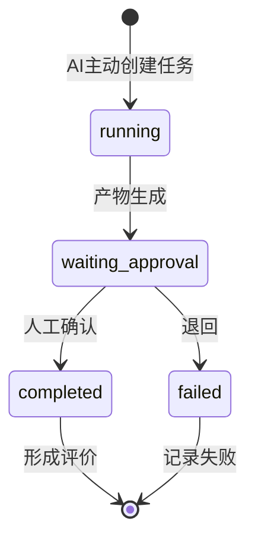

# V0.1 架构与边界

## 三层结构

1. **AI Native Core**：责任空间、AI 同事、任务、动作、审批、产物、事件和评价；
2. **Adapter / Domain Pack**：运行时适配器、治理策略及经营分析领域包；
3. **Application Shell**：行动中心、责任空间、AI 同事和产物中心。

## 核心状态变化

## V0.1 有意保留的替换边界

| 当前实现 | 稳定接口 | 企业实现 |
|---|---|---|
| JSON 文件 | Store | PostgreSQL |
| 确定性分析 | AgentRuntime | LangGraph / AgentScope |
| 本地样例数据 | Domain Tool | 集团数据通道 CLI |
| 代码规则 | GovernancePolicy | 权限中心 / 策略引擎 |
| 静态页面 | HTTP API | Next.js / 企业门户 |

## 不在当前版本

- 任意数据源与自动语义层；
- 多租户与复杂组织权限；
- 可视化拖拽编排；
- 无限自主运行；
- 通用知识库；
- 模型训练和自动调优；
- 多种运行时同时接入。

这些内容不会阻塞验证“责任—主动任务—治理—产物—评价”的最小闭环。

