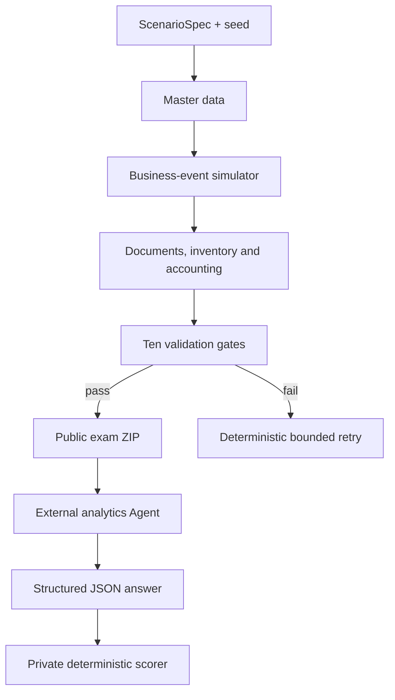

# Enterprise Analytics Sandbox — Project Handoff

**Handoff date:** 2026-07-30  
**Repository:** `enterprise-analytics-sandbox`  
**Primary branch:** `main`  
**Remote:** `https://github.com/zhanglinruo/enterprise-analytics-sandbox.git`

## 1. Product Positioning

This project is a deterministic enterprise analytics sandbox for testing AI+BI and
business-analysis agents. It creates a complete but fictional manufacturing enterprise
with connected sales, procurement, inventory and accounting data, gives a public exam
package to an Agent, and scores the Agent answer against private Ground Truth.

It can be used in two ways:

- as an independent synthetic-data and Agent-benchmark product;
- as the enterprise analytics domain pack and evaluation environment of the broader
  AI Native / AI Colleague framework.

The current MVP validates one question:

> Can we reproducibly create a financially coherent enterprise world containing a known
> business anomaly, let an external Agent analyze only public data, and score its answer
> without leaking the correct explanation?

## 2. Current Vertical Slice

The implemented scenario is:

```text
revenue_up_profit_down
```

The scenario covers January through December 2025 and injects three causal operating
changes in Q4:

1. core-material purchase prices increase;
2. low-margin product mix increases;
3. key-customer discounts increase.

The simulator changes operating parameters before events are generated. It does not edit
final financial statements or database results after generation.

## 3. Architecture



The single source of truth is the immutable business-event stream. Downstream tables and
financial statements are projections.

### Main packages

| Path | Purpose |
|---|---|
| `ainative/core/` | Generic responsibility, task, action, approval and evaluation kernel |
| `ainative/sandbox/spec.py` | Scenario identity, periods and reproducibility |
| `ainative/sandbox/schema.py` | Fifteen-table public SQLite schema |
| `ainative/sandbox/master_data.py` | Organizations, customers, suppliers, products, accounts |
| `ainative/sandbox/events.py` | Deterministic business-event simulator |
| `ainative/sandbox/scenarios.py` | Scenario parameters and private Ground Truth |
| `ainative/sandbox/accounting.py` | Documents, inventory and double-entry projection |
| `ainative/sandbox/validation.py` | Publishability and scenario-effect checks |
| `ainative/sandbox/service.py` | End-to-end orchestration and bounded retry |
| `ainative/sandbox/packaging.py` | Public CSV/SQLite/document ZIP and leak prevention |
| `ainative/sandbox/scoring.py` | Strict answer parser and deterministic score report |
| `ainative/cli.py` | Generate and score commands |

Detailed design:

- `docs/superpowers/specs/2026-07-28-enterprise-analytics-sandbox-design.md`
- `docs/superpowers/plans/2026-07-30-golden-scenario-sandbox.md`

## 4. Implemented Capabilities

### Scenario and data generation

- Fixed 12-month period and user-supplied integer seed.
- Stable benchmark identity for the same effective seed.
- 100 customers, 50 suppliers and 100 products.
- Two product lines: 70 `CORE` products and 30 `VALUE` products.
- Sequential deterministic IDs for events and business documents.
- Opening capital and inventory.
- Monthly sales, delivery, invoicing and receipts.
- Monthly purchase orders, goods receipts, supplier invoices and payments.
- Manufacturing completion and inventory transfer.
- Seasonality and scenario-driven operating changes.

### Relational and accounting model

The public database contains exactly five dimensions and ten fact tables:

```text
dim_organization
dim_customer
dim_supplier
dim_product
dim_account
fact_sales_order
fact_sales_delivery
fact_sales_invoice
fact_cash_receipt
fact_purchase_order
fact_goods_receipt
fact_supplier_invoice
fact_cash_payment
fact_inventory_movement
fact_journal_entry
```

Money is stored as integer cents. The accounting projection generates balanced vouchers,
inventory movements, revenue, cost of goods sold, receivables, payables, cash and equity.

### Validation gates

A benchmark cannot be packaged when a blocking or scenario-failure issue exists. Checks
cover:

1. voucher balance;
2. accounting equation;
3. non-negative inventory;
4. receivables reconciliation;
5. payables reconciliation;
6. non-negative cash;
7. source-event lineage;
8. foreign-key integrity;
9. document-date sequence;
10. configured scenario-effect range.

Concentrated customer, supplier, product or region distributions generate warnings.

### Public/private separation

The public ZIP contains:

- validated SQLite database;
- 15 UTF-8 CSV files;
- data dictionary;
- relationship documentation;
- metric definitions;
- neutral Chinese analysis task;
- manifest and checksums.

Private files retained beside the working benchmark include:

- Ground Truth;
- Cause IDs and weights;
- unsupported/forbidden claims;
- scoring state.

The packager scans public non-database files for private tokens and verifies that SQLite
contains only the 15 public tables.

### Scoring

Phase 1 accepts strict structured JSON. It scores:

| Dimension | Weight |
|---|---:|
| Anomaly detection | 20 |
| Numbers and metrics | 20 |
| Root cause | 25 |
| Reproducible evidence | 20 |
| Judgment boundary | 10 |
| Recommendations | 5 |

Forbidden unsupported causes receive penalties and cap the total score below 60.

## 5. CLI Workflow

Generate:

```bash
python -m ainative.cli sandbox-generate \
  --seed 61 \
  --output ./data/benchmarks/revenue-profit
```

Give the generated `bench_*.zip` to the Agent under test. Do not give it
`private-state.json`.

Score:

```bash
python -m ainative.cli sandbox-score \
  --benchmark ./data/benchmarks/revenue-profit \
  --answer ./answer.json
```

See `docs/sandbox/quickstart.md` for the answer schema.

## 6. Development Status

The original implementation plan has been completed through all ten tasks:

| Workstream | Status |
|---|---|
| Scenario specification | Complete |
| Public schema and master data | Complete |
| Business-event simulator | Complete |
| Scenario injection and Ground Truth | Complete |
| Documents, inventory and accounting | Complete |
| Consistency and scenario validation | Complete |
| Validated generation service and retry | Complete |
| Public package and leak prevention | Complete |
| Structured answer scoring | Complete |
| CLI, documentation and acceptance | Complete |

The implementation was developed with failing tests before production behavior.

## 7. Known Limitations

- Only one manufacturing scenario exists.
- Accounting is deliberately simplified: no VAT, foreign currency, payroll,
  depreciation, tax, complex BOM, complex overhead or full MRP.
- The sandbox generates a fictional enterprise from zero; it does not synthesize or
  anonymize uploaded real enterprise data.
- Agent answers must already be structured JSON. Natural-language answer extraction is
  not implemented.
- The sandbox has no dedicated Web interface. The existing `web/` directory belongs to
  the earlier AI Native Starter reference application.
- No direct Agent runtime integration exists; exchange is currently file based.
- No CI workflow is configured.
- Scenario ranges are protected by deterministic bounded retry. This is an intentional
  quality gate, but calibration should be revisited as more scenarios are added.
- Recommendation scoring checks presence and direct conflict only; it does not yet assess
  strategic quality.

## 8. Git State and Push Blocker

The cloud workspace initialized a Git repository, configured `origin`, and created the
initial implementation commit. GitHub push failed only because the cloud environment had
no GitHub credential or GitHub CLI.

The handoff ZIP includes `.git`, so after extracting it locally:

```bash
git status
git remote -v
git log --oneline --decorate -5
git push -u origin main
```

Authenticate through the local Git credential manager, browser flow, SSH or GitHub CLI.
Do not put a personal access token into source files or chat messages.

## 9. Definition of Done for the MVP

The MVP is considered technically complete because:

- the complete test suite passes;
- at least 20 input seeds produce publishable results through bounded deterministic retry;
- the generated ZIP contains all expected public assets;
- private Cause IDs and Ground Truth do not appear in the public package;
- a known-correct test answer scores at least 90;
- a hallucinated forbidden cause scores below 60;
- the same effective seed produces the same database checksum.

Business validation with an external AI+BI practitioner remains the next product milestone.

## 10. Recommended Local Codex Prompt

After extracting the ZIP, open the repository root in Codex and use:

```text
Read AGENTS.md and docs/handoff/PROJECT_HANDOFF.md completely. Then inspect the current
Git status and run the full test suite. Do not change code yet. Report the current
architecture, verified status, known limitations, and recommend the smallest next
experiment for validating the sandbox with an external AI+BI Agent.
```
